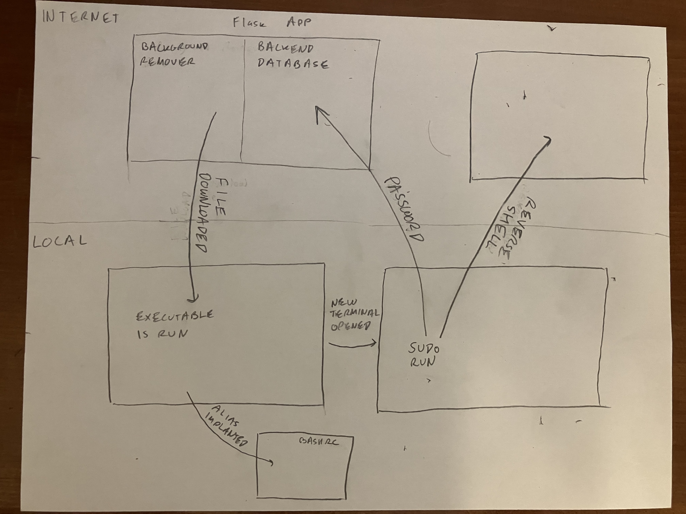

# Pseudo

## Authors: Abel Bellows, Michael Avrahami, Stanley Hoo


<!--  -->

---

## Introduction

**Pseudo** is a red-team simulation designed to demonstrate how social engineering and file disguise can be used to gain unauthorized access to user systems. It tricks naive users into installing our scripts and running it on their computer, stealing their sudo password and giving us access to their computer.

---

## Flowchart



## Initiation

Our Flask app acts as the **delivery platform** for the virus, posing as a **free** image background remover tool.

It:
- Accepts an image upload from the user
- Processes and disguises the result image as an `.exe` (Windows) or `.desktop` (Linux)
- Sends the file back to the user disguised as their image with the background removed to bait execution
- Stores stolen `sudo` credentials from compromised machines

---

## Active Virus

The virus can run with several modes.
1. NO_FLAG: When no flag is given ie. `./runme` the virus implants in the rc files of the user.
2. SUDO: when the flag SUDO is given (this occurs when the virus is run from the alias) `./runme SUDO '$@'` the virus mimicks sudo. This means the virus prompts the user for the password, execvps sudo to test if the password is correct and then execvps the cmd the user wanted to run. It also runs itself with sudo by execvping `/bin/sudo ./runme ROOT <passwd>` with the correct password.
3. ROOT: when the flag is set to ROOT the virus reads the second argument to determine the password and then launches the root level reverse shell to the attack server and returns the shell to the user.

---

## Windows/Linux Payload Generation

- A `.bat` file (Windows) and a `.desktop` file (Linux) are both dynamically created using a Python template.
- Flask runs a Python script that converts the `.bat` file into an `.exe`:
  ```python
  subprocess.run([
      "wine", Bat_To_Exe_Converter_Path,
      "/bat", batfile,
      "/exe", exe_path,
      "/icon", ico_path,
      "/invisible"
  ])
  ```
- The icon is set for both to match the result image to reduce suspicion.
- Depending on the target's operating system, downloads the `.desktop` or `.exe` file.

---

## Result: Disguised Executable

To the user:
- The file appears to be their result image.
- Opening it via double-clicking from file explorer shows the result image.

Behind the scenes:
- It installs and runs the virus payload.
- Both the executables (`.exe`, `.desktop`) are **self-deleted after execution**.
---

## Sudo Password Harvesting

The payload modifies `.bashrc`, `.zshrc`, `.dmrc`:
- Aliases the `sudo` command to `alias sudo="/path/to/the/virus SUDO '$@'"`
- Once the user reopens wsl and tries to sudo, our virus is run in the place of sudo and imitates it to get the user's password
- Captures:
  - Username
  - Password
  - IP address
  - hostname

This info is sent to our Flask backend and also sent in the init struct when the reverse shell is triggered.

---

## Credential Storage (Admin View)

- Flask stores credentials in a SQLite database.
- Admins can access a hidden route (`/pA55w0Rds`) to:
  - View stolen login data
  - See IPs and timestamps

---

## Reverse Shell Functionality

Once the alias has been implanted and the user runs sudo on a reopened terminal, our virus will capture the password. It does two things with it
1. Like described before it sends the password with some other info to the flask backend
2. It creates a reverse shell with escalated permissions that can be monitored by an attacker

Utilizing the Reverse Shell:
- The attacker creates a **listening server** and **user console** with which to manipulate that server
- Every virus that creates a reverse shell causes the server to fork and create a new child to receive the reverse shell
- The attacker can manipulate any of the targets that he wants through indexing his commands
- The attacker can also **destroy** the virus on the machine by typing in `d destroy` which deletes the executable and any other traces the virus left behind

---
